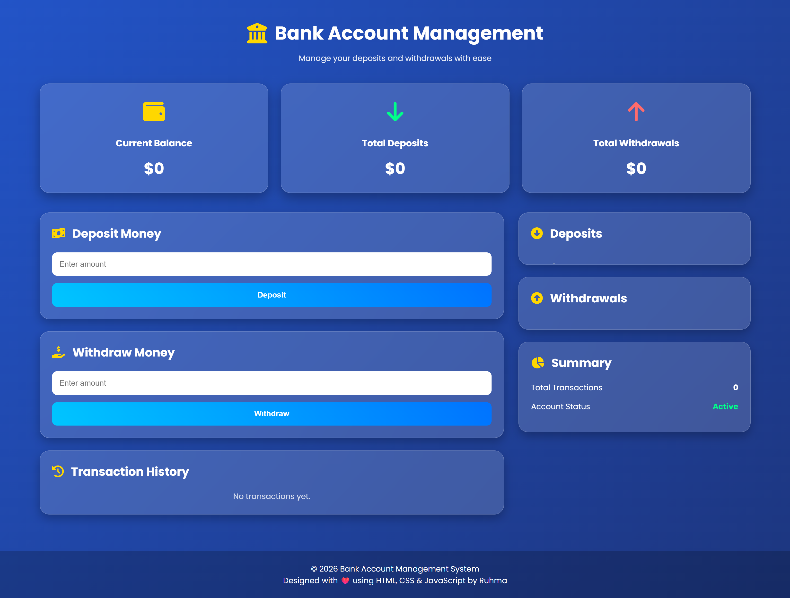
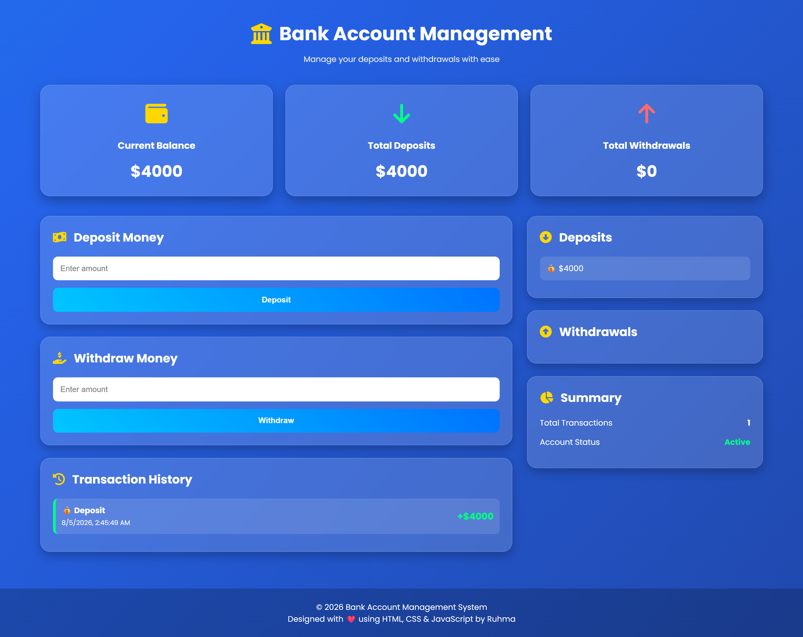
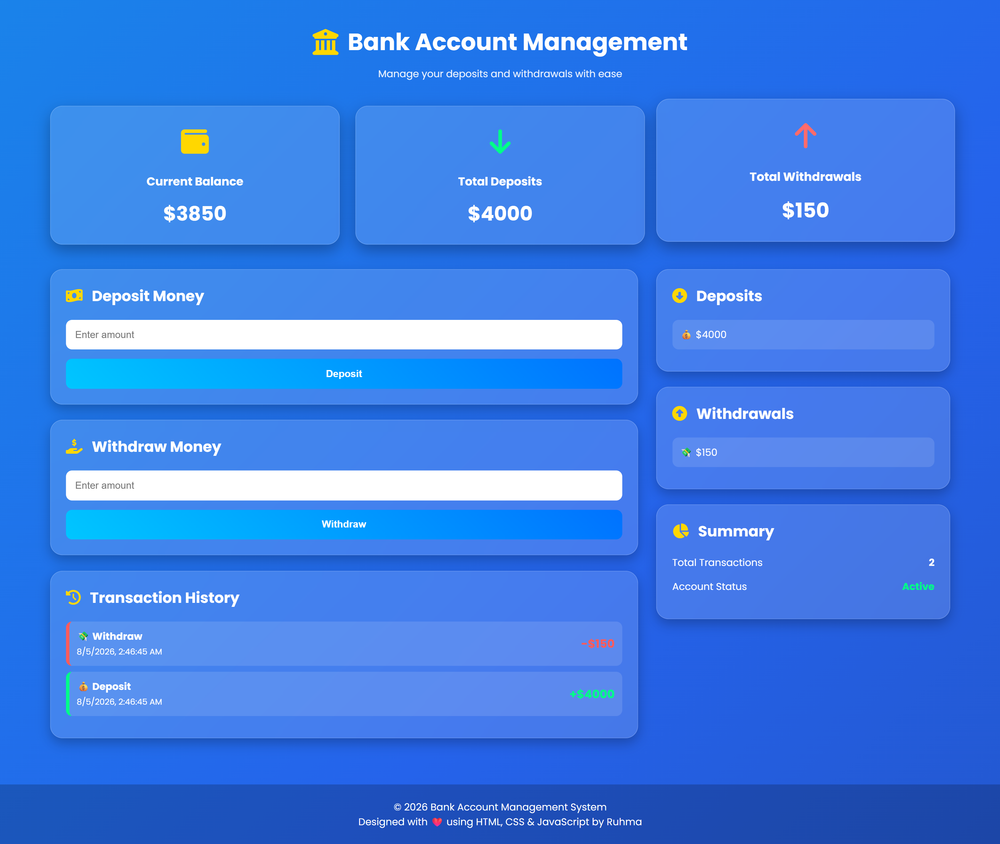
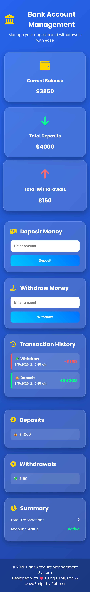

# 🏦 Bank Account Management System

A responsive and interactive **Bank Account Management System** built using **HTML, CSS, and JavaScript**.

The application allows users to deposit and withdraw money, track their account balance, and view transaction history in a modern  user interface.

---

## Live Demo

 https://YOUR_GITHUB_USERNAME.github.io/bank-account-management-system/


---

## 📸 Screenshots

### 🏠 Home Page



---

### 💰 Deposit



---

### 💸 Withdraw



---

### 📱 Mobile View



---

## ✨ Features

- Deposit money
- Withdraw money
- Real-time balance updates
- Total deposits
- Total withdrawals
- Transaction history
- Toast notifications
- Responsive design
- Local Storage support (data persists after refresh)

---

## 🛠️ Technologies Used

- HTML5
- CSS3
- JavaScript (ES6)
- Local Storage API
- Font Awesome
- Google Fonts (Poppins)

---

## 📁 Project Structure

```text
bank-account-management-system/
│
├── assets/
│   └── screenshots/
│       ├── home.png
│       ├── deposit.png
│       ├── withdraw.png
│       └── mobile-view.png
│
├── css/
│   └── styles.css
│
├── js/
│   ├── script.js
│   └── storage.js
│
├── index.html
└── README.md
```

---

## ⚙️ Installation

Clone the repository

```bash
git clone https://github.com/YOUR_GITHUB_USERNAME/bank-account-management-system.git
```

Open the project folder.

Open `index.html` in your browser.

---

## 💡 Future Improvements

- User authentication
- Multiple bank accounts
- Search transactions
- Filter deposits and withdrawals
- Export transaction history
- Backend integration
- Database support

---

## 👩‍💻 Author

**Ruhma Naseer**

Software Engineering Student

GitHub: https://github.com/Ruhma14

---

## ⭐ Support

If you like this project, consider giving it a ⭐ on GitHub.